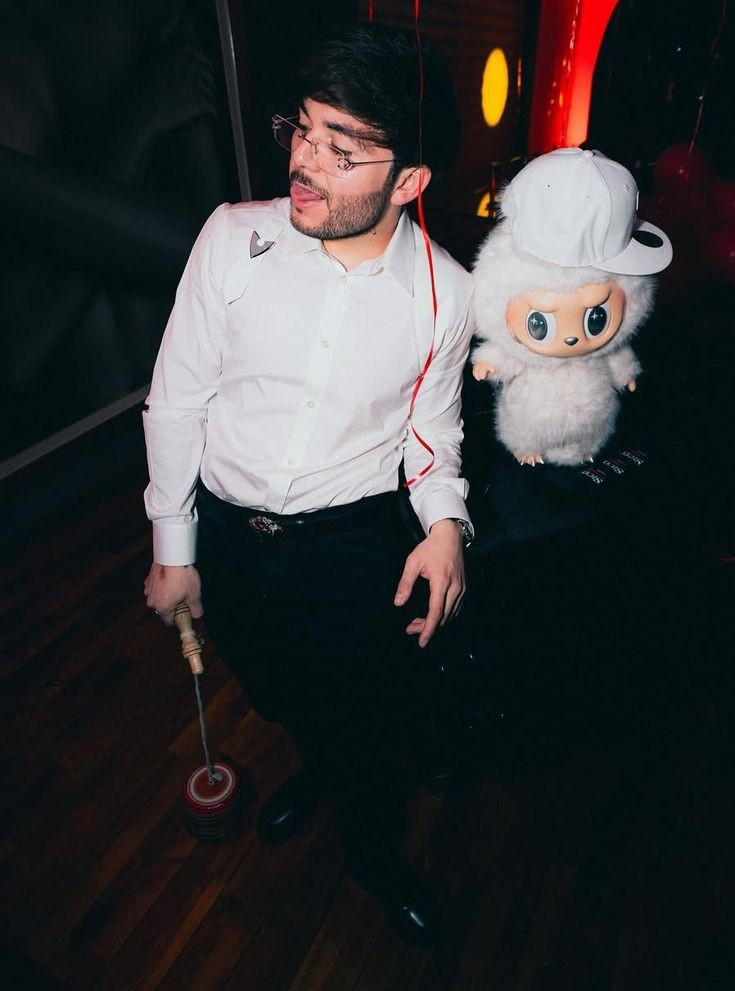

<html>
<head>
    <meta charset="UTF-8">
    <meta name="viewport" content="width=device-width, initial-scale=1.0">
    <title>Corridos Tumbados</title>
    <link rel="stylesheet" href="web.css">
</head>
<body>

<header class="header">
    <h1 class="titulo-sitio">Corridos Tumbados</h1>
    
    <nav class="menu">
        <select onchange="location = this.value;">
            <option value="index.html">Corridos Tumbados</option>
            <option value="formulario.html">Gera MXM</option>
        </select>
    </nav>
</header>

<main class="contenido">
    <h2>Bienvenido al mundo de los Corridos Tumbados</h2>
    
Explora el género que mezcla corridos tradicionales con ritmos urbanos, letras crudas y estilo auténtico. Desde Natanael Cano hasta Junior H, esta es la nueva voz de la calle.

    
    <section class="artistas">
        

            
            
Natanael Cano

            <small>El pionero de los corridos tumbados, con letras que cuentan historias reales desde Hermosillo, Sonora.</small>
        

        

            
            
Gabito Ballesteros

            <small>Joven talento con estilo suave y letras pegajosas, fusionando lo urbano con lo regional.</small>
        

        

            
            
Tito Doble P

            <small>Parte del movimiento de La Doble P, llevando su flow único a cada tema.</small>
        

        

            
            
Junior H

            <small>Con letras melancólicas y estilo relajado, Junior H pone el alma en cada verso.</small>
        

    </section>
</main>

<footer class="footer">
    
&copy; 2025 Corridos Tumbados - Todos los derechos reservados

</footer>

</body>
</html>            
