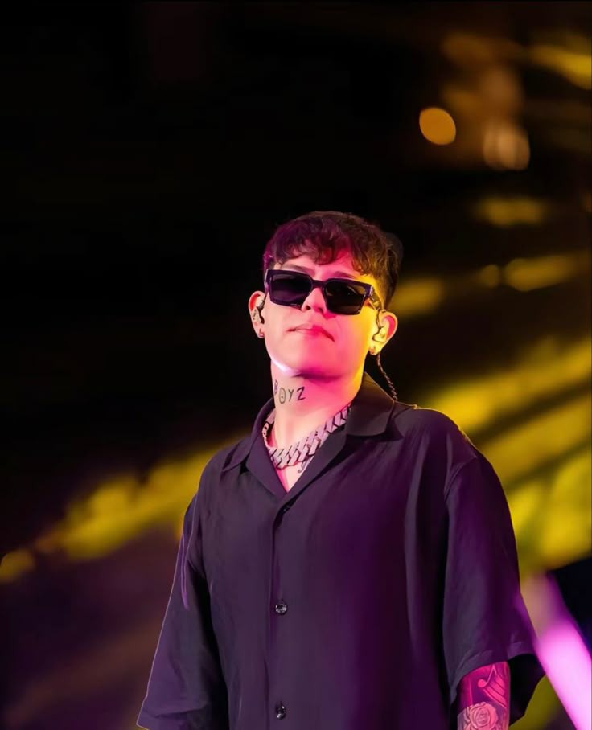

<html>
<head>
    <meta charset="UTF-8">
    <meta name="viewport" content="width=device-width, initial-scale=1.0">
    <title>Corridos Tumbados</title>
    <link rel="stylesheet" href="web.css">
</head>
<body>

<header class="header">
    <h1 class="titulo-sitio">Corridos Tumbados</h1>
    
La nueva era del regional mexicano con esencia urbana

</header>

<main class="contenido">
    <section class="introduccion">
        <h2>Bienvenido al universo de los Corridos Tumbados</h2>
        
Sumérgete en un género musical que desafía las normas, mezclando los corridos tradicionales del norte de México con influencias del trap, hip hop y reguetón. Letras sinceras, narrativas de vida callejera, y un sonido fresco que conecta con las nuevas generaciones.

    </section>

    <section class="artistas-destacados">
        <h2>Artistas Destacados</h2>
        

            

                
                <h3>Natanael Cano</h3>
                
Considerado el pionero del género, Natanael ha roto barreras con su estilo irreverente. Su fusión de corridos con trap ha marcado un antes y un después en la música mexicana contemporánea.

            

            

                
                <h3>Gabito Ballesteros</h3>
                
Con una voz distintiva y una habilidad para conectar con la juventud, Gabito ha escalado rápidamente en la escena. Sus temas versátiles van desde lo romántico hasta lo reflexivo.

            

            

                
                <h3>Tito Doble P</h3>
                
Uno de los nombres emergentes más potentes del sello La Doble P. Tito aporta flow, presencia escénica y letras que retratan realidades actuales con frescura.

            

            

                
                <h3>Junior H</h3>
                
Maestro de los corridos melancólicos, Junior H ha conquistado corazones con su estilo introspectivo. Su autenticidad lo convierte en uno de los más respetados del movimiento.

            

        

    </section>

    <section class="historia-genero">
        <h2>¿Qué son los Corridos Tumbados?</h2>
        
Muchos no lo saben pero los elementos del polka y folclórica fueron introducidos a México por europeos en el 1830, el sonido de la guitarra y el acordeón fueron adaptados por gente del pueblo, adquiriendose como música propia, artistas como Narciso Martínez, recuerdan haber escuchado la polka cuando eran tan solo niños sin enbargo algunos artistas reemplazaron los instrumentos del latón con otros sonidos también comenzaron a contar sus propias historias y uso de las letras, para dar noticia durante la revolución, estás canciones se conocerían como boleros mexicanos, una base para los generos que vendrían, con el tiempo la música norteña tocada en tierras rurales comenzaría a fusionarse con los clásicos del bolero, este dió luz a una nueva forma de interpretar la música conocida popularmente como la música ranchera "canciones de la tierra". Décadas más tarde artistas como Pedro infante llevaron la música ranchera a su centro de atención, sus baladas románticas se hicieron reconocer en todo el mundo como música propia de México, luego vinieron los tigres del Norte y todo cambió, en los años 70 los tigres del Norte popularizaron una canción ficticia sobre el narcotráfico, llamado "contrabando y traición" ese corrido fue exitoso y controversial, esto dió comienzo al género "narcocorrido", los tigres del Norte fueron unos de los pioneros en el género "narcocorrido" y aunque el apetito por su música era feroz México prohibió el género empujando a los músicos a las ciudades fronterizas y finalmente a los Estados Unidos, luego vino Chalino Sánchez un granjero con un gran corazón de acero y un amor por el narcocorrido con él trajo la música de estilo bandas de Sinaloa, Sánchez escribió canciones "hechas a medida" inmortalizar a los narcotraficantes, justo en esa época la ciudad de los Ángeles estaba presenciando un nuevo movimiento de "Gangstar Rap", los mexicoamericanos y los afroamericanos, compartieron varios espacios en el centro de la ciudad observando las culturas y los estilos musicales de los demás, al igual que el movimiento de "Gangsta Rap" Sánchez cantaba sobre la violencia, las drogas, y los carteles mexicanos, Chalino Sánchez sería Coronado como el "rey" del "narcocorrido" mientras que los corridos se congelaban en el tiempo el "Gangsta Rap" se generalizó y empezó a hacer respaldado por las principales discográficas convirtiéndose en sinónimo de pop hasta que se introdujo la música trap, el espíritu de la música trap atrajo a los jóvenes artistas mexicanos, repasando las influencias fundamentales de los ritmos urbanos, la sensibilidad del hiphop y la superposición de las letras de los corridos, lo desglosaron y lo recrearon a lo que ahora llamamos "Corridos Tumbados".

    </section>
</main>

<footer class="footer">
    
&copy; 2025 Corridos Tumbados - Todos los derechos reservados

    
Desarrollado por amantes del regional con alma urbana.

</footer>

</body>
</html>        
